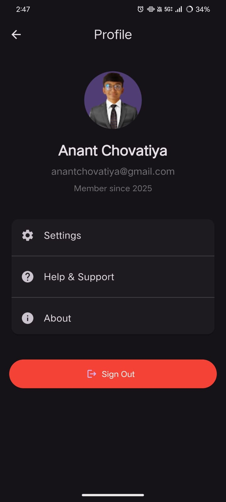

# DhanSetu App

A comprehensive Flutter app for tracking expenses with analytics and visualizations.

## Features

- **Expense Management**
  - Add, edit, and delete expenses
  - Categorize expenses
  - Add notes to expenses
  - Filter expenses by date range

- **Category Management**
  - Create custom categories
  - Choose colors and icons for categories
  - Edit or delete existing categories

- **Analytics and Visualizations**
  - Pie charts showing expense distribution by category
  - Bar charts showing monthly expense trends
  - Detailed breakdown of expense categories with percentages

- **Filtering Options**
  - Quick filters for today, week, month, and year
  - Custom date range selection

## Technologies Used

- **Flutter**: Cross-platform UI framework
- **Provider**: State management
- **SQLite**: Local database for persistent storage
- **fl_chart**: Chart visualizations
- **intl**: Internationalization and formatting

## Getting Started

1. **Prerequisites**
   - Flutter SDK installed
   - Android Studio or VS Code with Flutter extensions

2. **Installation**
   ```bash
   # Clone the repository
   git clone https://github.com/yourusername/expense_tracker.git

   # Navigate to the project directory
   cd expense_tracker

   # Install dependencies
   flutter pub get

   # Run the app
   flutter run
   ```

## Project Structure

- **lib/models/**: Data models for expenses and categories
- **lib/providers/**: State management using Provider
- **lib/screens/**: UI screens
- **lib/widgets/**: Reusable UI components
- **lib/utils/**: Utility functions and formatters
- **lib/db/**: Database operations and helpers

## Screenshots





## Future Enhancements

- Budget planning and tracking
- Receipt scanning and OCR
- Expense forecasting
- Data export to CSV/PDF
- Cloud synchronization
- Multiple currency support
